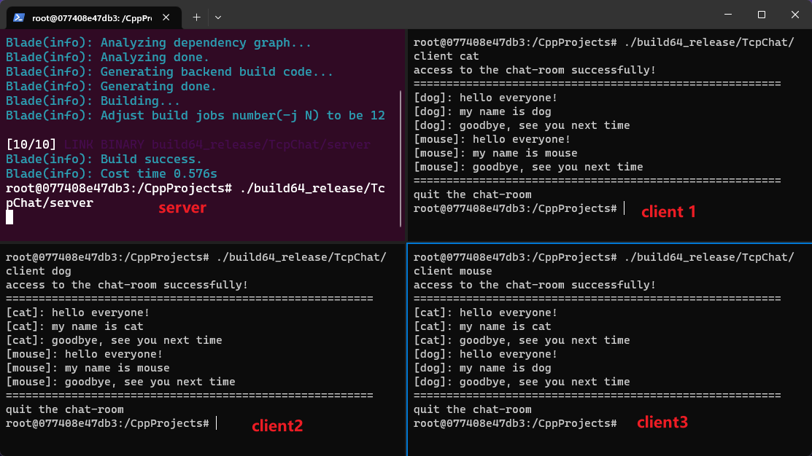

# TcpChat

## TcpServer

TcpServer 使用 epoll 实现并发处理多个连接请求，每个连接套接字都是在**非阻塞模式**下处理，这使得服务器能够同时处理多个连接请求并且不会因为某个连接被阻塞而影响其他连接的处理。当有新的连接请求时，服务器将新连接套接字加入 epoll 实例，并等待数据的到来。当某个连接上有数据到来时，服务器将数据读入 buffer 中，并转发给其他客户端，如果客户端关闭连接，则服务器关闭连接套接字，并从 epoll 实例中移除。

## Docker

```bash
# 进入文件夹
cd CppProjects

# 构造 docker 镜像
bash docker_build.sh

# 创建并进入 docker 容器
bash docker_run.sh
```

## Build

在 docker 环境中执行:

```bash
# 编译 TcpServer 和 TcpClient
$ blade build TcpChat

# 运行 server 端
$ ./build64_release/TcpChat/server

# 运行多个 client 端
$ ./build64_release/TcpChat/client cat
$ ./build64_release/TcpChat/client dog
$ ./build64_release/TcpChat/client mouse
```

运行例子：


