# 谁是2018“第一”国产电影

## 海选：票房才是话语权

酒香也怕巷子深，虽然票房不是衡量影片好坏的唯一标准，但是票房一定程度反映了包括你我在内的广大群众对该影片的偏好。
这里，我们简单粗暴地挑选2018年三部年度总票房突破“30亿”的大片：《红海行动》、《唐人街探案2》和《我不是药神》。

## 初赛：基本面分析

### 1.票房信息

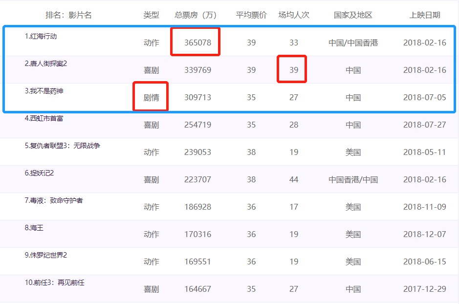

我们选取的三部影片年度总票房都超过了30亿，票房最少的《我不是药神》都比排名第10的《前任3：再见前任》高出将近一倍。从中国票房网上的年度票房数据情况上看，三部电影各有千秋：  
（1） 从**年度总票房**上看，《**红海行动**》略胜一筹，36.5亿拔得头筹。  
（2） **场均人次**上看，《**唐人街探案2**》达到了39人，可谓“座无空席”。
（3） 作为**前十唯一的剧情片**，《**我不是药神**》在动作、喜剧的票房杀手中杀出重围。

### 2.搜索热度

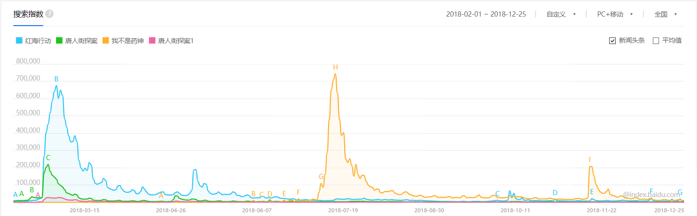

百度作为最常使用的中文搜索引擎，我们用百度搜索指数“还原”影片上映期间的搜索热度，可以看到《我不是药神》和《红海行动》搜索热度相近（《我不是药神》有更高的搜索峰值，但《红海行动》搜索热度持续时间更长）。相比之下，作为续集的《唐人街探案2》在“吸纳”了《唐人街探案1》的热度后反而发力不足，在搜索热度上完败。

### 3.讨论热度

讨论热度衡量影片的话题性和公众自发的讨论热度。作为国内即时通讯一哥的微信，我们用微信指数作为衡量影片讨论热度的指标。

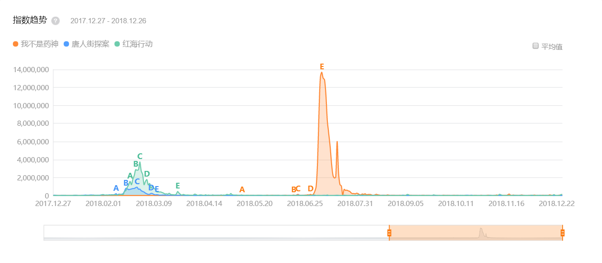

可以看到讨论热度上，**《我不是药神》“吊打”其余两部影片，用生命救赎和仿制药的冲突掀起了一波讨论狂潮，制造了空前的话题性**。  
同时，带着“爱国”属性的《红海行动》也比商业喜剧《唐人街探案2》具有更大的可讨论性。

### 4.人群画像

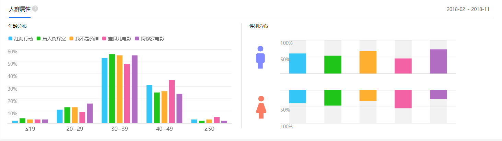
由于分析的时间跨度为一年，并不是所有观众都在电影院看的这三部电影，因此我们仍然用百度指数的人群画像来分析搜索人群的特征。  

#### 4.1 三部影片的观众特征  

可以看到除了**《红海行动》的观众略微偏向“中老年”（大于40岁）观众外**，三部“30亿”的影片观众年龄分布较为相似，主要观众年龄处于30-49（和我的预期不太一致~）。  
从性别分布上看，《红海行动》和《唐人街探案2》男女分布较为平均，**但是观看《我不是药神》的男性比例要显著多于女性**。  

#### 4.2 票房电影和流量电影的观众特征比较  

我挑选了两部流量电影，一部是杨幂的《宝贝儿》，另一部是吴磊的《阿修罗》。可以看到流量电影的性别比例更加失衡，不过个人对百度的人群画像数据持怀疑态度，因为20-29岁上网主力军的存在感有点太低了。

### 5.豆瓣评分

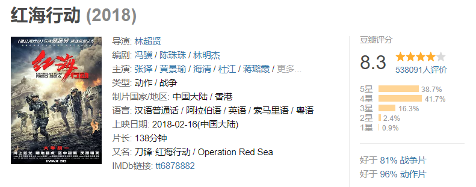

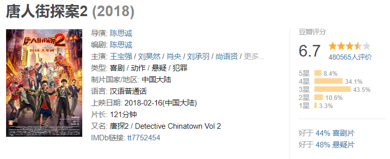

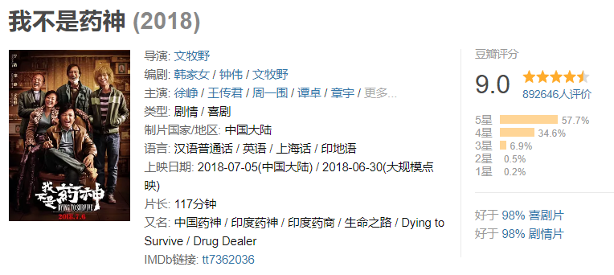

在国内影评可信度较高的豆瓣，我们可以看到《**我不是药神》讨论热度和评分双丰收**，《红海行动》评分也拿到了较高的8.3，但是《唐人街探案2》不及同类型电影的平均水平，仅仅只有6.7分。

### 6. 基本面分析结论

基本面各方面分析中《红海行动》表现尚佳，《我不是药神》通过掀起讨论狂潮成为票房口碑双丰收的佳片，相比之下《唐人街探案2》各方面表现平平，**因此国产“第一”电影将在《红海行动》和《我不是药神》的角逐中产生**。

## 决赛：影评数据分析

我们下一步通过挖掘豆瓣影评信息，实现对两部部影片的深度分析。  

### 1. 数据获取

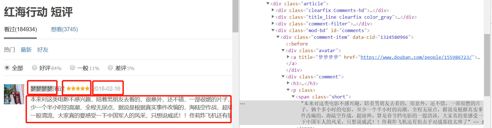  

我们尝试简单地爬取《红海行动》和《我不是药神》**豆瓣短评的用户昵称、评论内容、评论日期、点赞数**（其他用户对该条评论的点赞）和**星级数**（用户给电影的打分，50对应5星评价），为下一步的分析做准备。  
注：由于豆瓣对爬虫的限制，我们只能爬取两部影片各500条短评的数据，虽然会对最终的分析结果产生干扰，但大体结论应该出入不大。

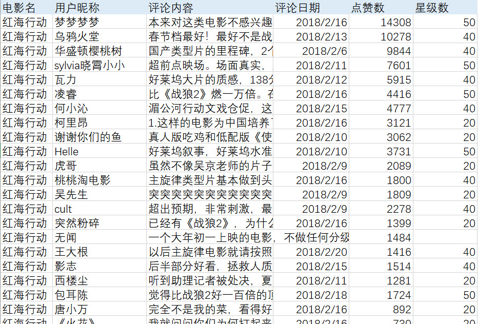  

### 2.电影评分时间走势分析

在仔细分析两部电影的评论数据之前，我们先看一下两部电影的评分走势。该步骤主要是为了查看两部电影的影评是不是存在恶意“差评”或者“水军”刷分的情况，保证两者比较的公平性。

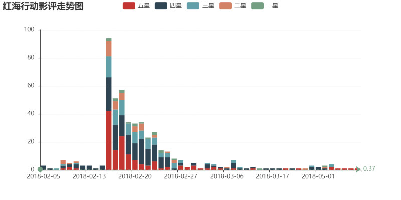

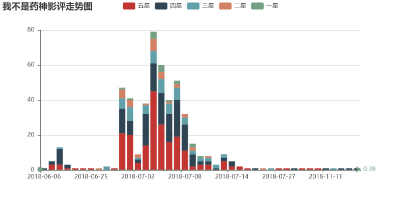

注：《红海行动》上映日期2月16号，《我不是药神》6月30号大规模点映，7月5号上映
可以看到豆瓣影评数在两部电影上映期间达到峰值，并且两部电影三星以下的评价都较少（《我不是药神》的低星评价更少从而获得更高的豆瓣评分）。**可以看到两部电影的评分走势没有显著的异常，因此不存在人为的故意“灌水”/“抹黑”的情况。**

### 3.豆瓣影评情感分析

我们对两部影片的每条评论进行情感分析，得分高于0.5的为正面情绪，得分低于0.5的为负面情绪，最终得到的两部电影情感分析图如下：

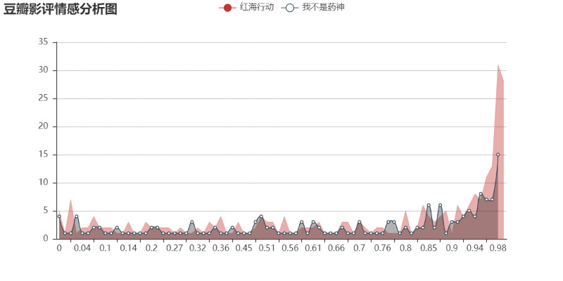

从豆瓣影评情感分析图中，我们可以发现两部电影情感得分≤0.94的影评数量分布基本一致，但是情感接近1的影评数量《红海行动》要占绝对优势。我翻看了两部电影的豆瓣影评后发现，《红海行动》影评大多提及影片的热血和刺激，用词更偏正面性；但是《我不是药神》由于其选题扎根生活，引发的更多是对于生命救赎的思考。因此我认为在影评的情感分析上两部影片都表现不错。

### 4.影评词云分析

我们对两部影片的评论绘制词云图：  

可以看到，《红海行动》作为典型的爱国主旋律战争片，**影评强调的是“中国”和“主旋律”。但是同时作为一部写实的战争片，它又自带“血腥”的负面属性**，这也和我们在电影人群画像部分的分析中看到的年龄分布偏“中老年化”相吻合。血腥的战争镜头可能不适合低龄观众观看。  
《我不是药神》影片中既有**对故事的肯定**：“煽情”，“现实”，“题材”，同时**又引发了人们的反思**：“问题”，“希望”，“社会”。  

## 结论

电影到底是为了追求带给人们强烈的视觉体验还是带给人们对生活的反思，这个问题可能需要一代又一代的导演去权衡去解决。在《红海行动》之前，类似题材《战狼2》已经创造了56亿的票房，带给观众的观感体验有所减弱。而《我不是药神》作为出色的商业片收获30亿票房的同时，又能紧扣现实题材，掀起了民众巨大的讨论狂潮，不能说后无来者但也是前无古人了。  
在这个意义上，我觉得《我不是药神》已经胜利了，希望中国出现越来越多类似的商业影片，别寒了用心拍戏导演的心。

## 相关工具

1.爬虫：八爪鱼采集器  
2.绘图：pyecharts  
3.文本分析：snownlp，jieba，wordcloud  
4.图片处理：photoshop  
